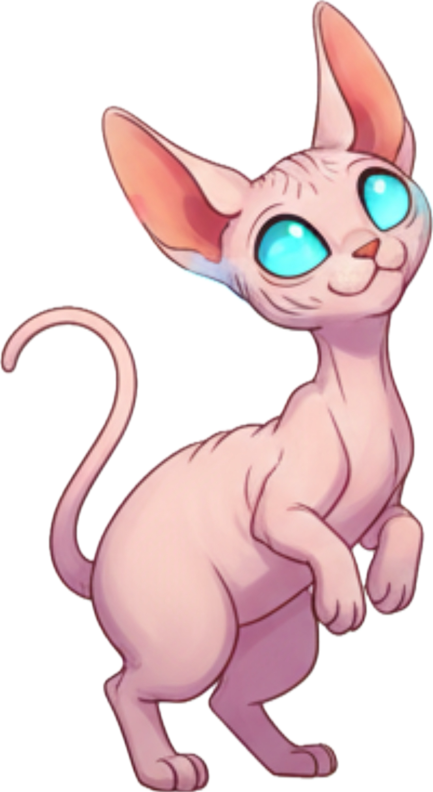
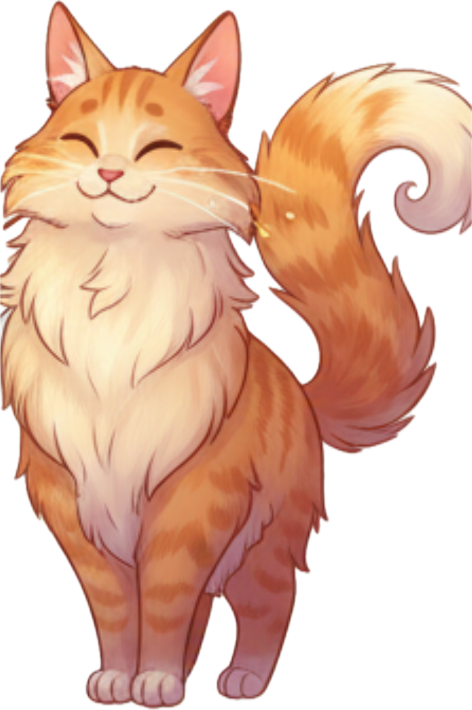
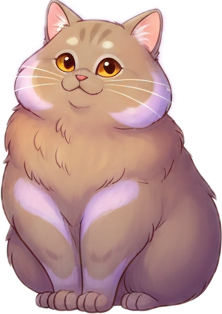
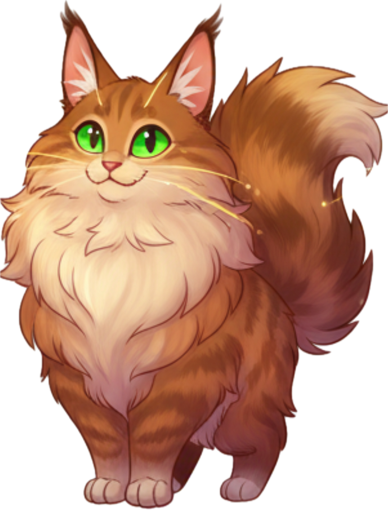

# WhiskerBytesCatCafe
<!DOCTYPE html>
<html lang="en">
<head>
<meta charset="UTF-8">
<title>WHISKER BYTES</title>
<meta name="viewport" content="width=device-width, initial-scale=1.0, maximum-scale=1.0, user-scalable=no, shrink-to-fit=no">

</head>
<body>

    

 
    

        
MOCHI Patience+

        
GINGER Tips+

        
LUNA Speed+

        
JINX Luck+

    

    
🐾 Credits

    

        <button class="close-credits" onclick="closeCredits()">✕</button>
        

            <h2>🐾 Whisker Bytes</h2>
            
<strong>Created by</strong> Lori Kaye Sifuentes

            
<strong>Customer Sprites Inspired By</strong> Luna & Stella 💖

            
<strong>Dev Note</strong> Whisker Bytes was made from a few quiet ideas and HTML magic. Thank you for visiting—paws up for staying a while. 🐾

            
Made with love, cats, and imagination.

        

    

    ⭐ 0 | 🏆 BEST: 0 
    🕒 9:00 AM | 🐾 Empty

    <button class="ui-btn" onclick="location.reload()">▶ NEW DAY</button>

<canvas id="game"></canvas>

    

        

<button class="ctrl-btn" id="up">⬆️</button>

        <button class="ctrl-btn" id="left">⬅️</button>
        <button class="ctrl-btn" id="down">⬇️</button>
        <button class="ctrl-btn" id="right">➡️</button>
    

    <button class="ctrl-btn" id="action-btn" style="width:160px; border-radius: 35px; background:var(--pink);" onpointerdown="interact()">📢 MEOW</button>

</body>
</html>
